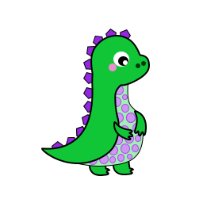
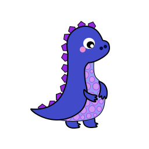
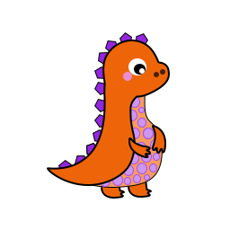
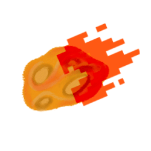
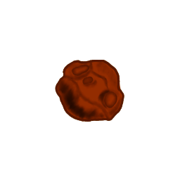
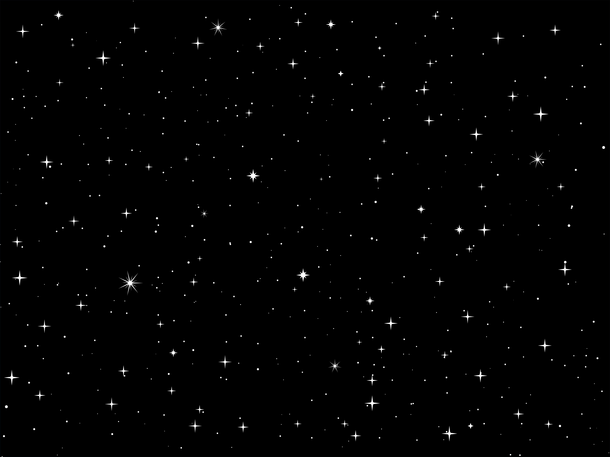

# CART 263 FINAL PROJECT: A PLAYFUL INTERACTION,  
## Authors: Mollika Chakraborty and Negar Roofigariesfahani
## Project Title: The Dino Experience 

### Rough Sketches and Mood Boards: 

### Proof of Concept: 
This project explores an imaginative world for a little Dinosaur who is in danger of becoming extinct due to asteroid attacks and volcanic disruptions leading to extreme climatic variations. Dino is set to travel to the nearest planet, Mars. With the use of the speech library Annyang we have created a unique, immersive and engaging experience for the players.

### Motivation 

Why we decided use a speech library: Speech libraries are not very often used for games because they have their constraints, from processing speech to executating commands. In general speech is a very abstract non certain form of human expression. Everybody has a different voice and different way of pronounciation, additionally different computer microphones, and connection also play huge roles. Therefore, we took it as a challenge to make it work. We tried diffrent speech commands and different speech libraries out there.
What we learned from the process: In our case, we saw great improvement when the tool only captures what the user has said and checks if it matches with the command, rather than recognizing and collecting a continuous string of words. furthermore, since a function is called everytime an event is triggered, after repeating the same command multiple times, the function doesn't recognize it as a new event, thinking that it has already executed it, therefore a little delay between saying the word is needed for the code to realize that it needs to execute the command again. We wanted to minimize the delay, so our solution was to have two synonymous words that call to the same function, be used alternatively.

### Game Process: 
* The game requires 2 players to be in the same environment. Player 1 is the Dino and player 2 is the asteroid shooter.

*   Player 1 wins by reaching mars, and loses when its health gets 0. Handicap aspect: speech recognition.
*   Player 2 wins by killing the dino and loses when Dino reaches mars. Handicap aspect: rotation.

* The movement of Dino is contolled using speech recognition.

* The movement of the asteroid shooter is controlled using the left and right arrow keys and space key is used to fire asteroids. 

* The controls and commands for the games are explained in the "instructions" page for easy accesibility and building upon convinient user experience practices. 

 

### Inspirations:  
Angry Birds, Doodle Jump, Chrome Offline Dinosaur Game. 

### Game Aesthetics 

* The Landing Page 

* Characters 

* Asteroid Shooter

* Background Images 

* Other Assets 

### Library Scripts Used 
* 

* 

* 

* 

### Feedback:
* Try to incorrporate the fun personalities (of the authors) into the character to create a narrative and to make the game interaction more playful.

* Try to develop the game further by creating multiple levels and let Dino explore more of the invironment

* Add more commands in the game so that the user doesn't feel monotonous toggling through just 2 commands.

* Try to add more mechanics that hides the constraints of the game, or make them seem intentional.

* Add more floating elements in the space, so that the whole canvas is utilised and the action area of the is not restricted to just the bottom part of the canvas.

* Incorporate scores more heavily into the game for example: Dino gaining scores can result in an increase in health points. Asteroid shooter gaining scores can result in stronger laser damage level.

### Differences in relation to playtest 

* During playtest we wanted the Dinosaur to travel through various planets and eventually come back to Earth. That concept was modified due to technical and time constraints and we decided to center it around Dino escaping to mars.  

* We decided to us Annyang speech library instead of p5.js speech library.

* Inclusion of a 3D elements was thought of, but we decided to create a the parralax background effect and keep the game is 2D in nature as the file started getting heavier with aesthetics. 

### Teamwork Experience 
 
* Despite having our own strengths and weaknesses to improve upon, we were able to support each other throughout the entire process of creating the game.
* Our success was largely due to our effective communication, which allowed us to resolve any issues that arose during development.
* Collaborating on this game was a beautiful experience, and we both recognized and appreciated each other's contributions to the coding and aesthetics.

### Acheivements 

* We tried this game with other friends and families apart from our classmates and they had amazing responses which made us feel proud of our work.

* We learned and explored new ways to implement our imagination to code. 

* Our approach to coding improved significantly from where we began and we both feel like we understand more deeply the process that goes through making a playful interaction piece.

* We were proud to have created a game entirely on our own that functions as we intended it to. 

### Challenges 

* Working with the speech library and making the character move according to the objective, whilst taking into account lags and delays.

* Working the math and physics for the asteroid shooter so that it pushes asteroids according to its rotation angle. 

* Working with high quality graphics, it was challenging for both of us and our computers. 

### Overview 

This project has been a beautiful journey for two game enthusiasts who shared a clear vision from the outset: to develop a game. Throughout the process, our communication was incredible, and we complemented each other's strengths and weaknesses. This game is special to us as it's the first we've ever created, and we hope it brings joy and laughter to our users with its unique and quirky gameplay. We've learned a lot from this experience and plan to carry this knowledge forward into our future game-making endeavors. We appreciate all the feedback from experts and fellow creators and will do our best to incorporate it. We're grateful for this journey and want to thank everyone who has been a part of it.

### References 

* Coding
https://www.youtube.com/playlist?list=PLBDInqUM5B26FjwMMZqGDxqQr1kX5V9Ul

https://editor.p5js.org/simontiger/sketches/r16tcHq3e

https://editor.p5js.org/chjno/sketches/ByZlypKWM

* Aesthetics 
https://stock.adobe.com/ca/search/images?filters%5Bcontent_type%3Aphoto%5D=1&filters%5Bcontent_type%3Aillustration%5D=1&filters%5Bcontent_type%3Azip_vector%5D=1&filters%5Bcontent_type%3Aimage%5D=1&order=relevance&price%5B%24%5D=1&safe_search=1&k=space+vector&search_page=1&search_type=usertyped&acp=&aco=space+vector&get_facets=0&asset_id=289726988

https://www.pngwing.com/en/free-png-zlgxv

https://pngtree.com/freepng/smooth-glossy-heart-vector-file-ai-and-png_7683158.html

* Music 
https://youtu.be/vX1xq4Ud2z8

https://mixkit.co/free-sound-effects/game/?page=2

https://freesound.org/people/cabled_mess/sounds/350924/

